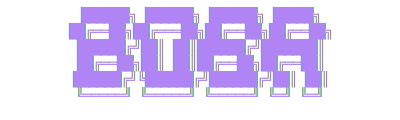

<p align="center">
  
</p>

<p align="center">
  
  
  
  
</p>

<p align="center">
  <b>Connect Claude to Boba trading in seconds.</b>
</p>

<p align="center">
  <a href="#install">Install</a> ·
  <a href="#quick-start">Quick Start</a> ·
  <a href="#commands">Commands</a> ·
  <a href="#how-it-works">How It Works</a>
</p>

<br />

## Install

```bash
curl -fsSL https://raw.githubusercontent.com/Able-labs-xyz/Boba-CLI/main/install.sh | bash
```

<details>
<summary>Other installation methods</summary>

**npm**
```bash
npm install -g @boba/cli
```

**yarn**
```bash
yarn global add @boba/cli
```

</details>

<br />

## Quick Start

```bash
# 1. Set up your agent credentials (from agents.boba.xyz)
boba init

# 2. Configure Claude Desktop & Claude Code
boba install

# 3. Launch everything
boba launch
```

<br />

## Commands

| Command | Description |
|:--------|:------------|
| `boba init` | Set up agent credentials |
| `boba start` | Start the MCP proxy server |
| `boba install` | Auto-configure Claude Desktop & Code |
| `boba launch` | Start proxy + open Claude |
| `boba status` | Show connection status |
| `boba config` | View or update configuration |
| `boba logout` | Clear stored credentials |

<details>
<summary>Command options</summary>

```bash
boba start --port 4000           # Custom port
boba install --desktop-only      # Claude Desktop only
boba install --code-only         # Claude Code only
boba launch --desktop            # Open Desktop instead of Code
boba launch --iterm              # Use iTerm instead of Terminal
```

</details>

<br />

## How It Works

```
┌─────────────┐      ┌─────────────┐      ┌─────────────┐
│   Claude    │ ───▶ │  Boba CLI   │ ───▶ │  Boba MCP   │
│  (no creds) │      │   (proxy)   │      │  (backend)  │
└─────────────┘      └─────────────┘      └─────────────┘
   localhost            JWT auth           trading API
```

- Claude never sees your credentials
- You control access — stop the proxy anytime
- Full audit trail — all tool calls logged

<br />

## Security

| | |
|:--|:--|
| **Credential Storage** | OS Keychain (macOS Keychain, Windows Credential Manager) |
| **Transport** | HTTPS only |
| **Access Control** | Revoke anytime at [agents.boba.xyz](https://agents.boba.xyz) |

<br />

## License

MIT

<br />

---

<br />

> [!WARNING]
> **This software is experimental.** Provided "as is" without warranty of any kind.
>
> **Use at your own risk.** Boba assumes no liability for any losses or damages arising from use of this software.
>
> **Trading involves significant financial risk.** Never trade more than you can afford to lose.
